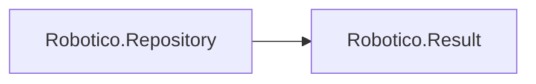

# Robotico.Repository

[](https://dotnet.microsoft.com/download/dotnet/8.0)
[](https://dotnet.microsoft.com/download/dotnet/10.0)
[](https://github.com/robotico-dev/robotico-repository-csharp/packages)
[](https://github.com/robotico-dev/robotico-repository-csharp/actions/workflows/publish.yml)

Reference **Robotico.Repository** when you use the **Repository pattern** (Repository + Unit of Work). Interfaces: `IEntity<TId>`, `IRepository<TEntity,TId>` (GetById returns `Result<TEntity>`, Add, Update, Remove), `IUnitOfWork` (CommitAsync returns `Result`).

## Robotico dependencies



## Installation

```bash
dotnet add package Robotico.Repository
```

## License

See repository license file.
