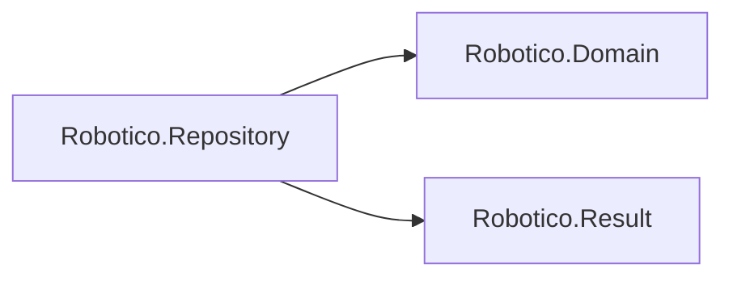

# Robotico.Repository

[](https://dotnet.microsoft.com/download/dotnet/8.0)
[](https://dotnet.microsoft.com/download/dotnet/10.0)
[](https://github.com/robotico-dev/robotico-repository-csharp/packages)
[](https://github.com/robotico-dev/robotico-repository-csharp/actions/workflows/publish.yml)

Reference **Robotico.Repository** when you use the **Repository pattern** (Repository + Unit of Work). Interfaces: `IRepository<TEntity,TId>` and `IAsyncRepository<TEntity,TId>` (uses **Robotico.Domain** `IEntity<TId>`), `IUnitOfWork` (CommitAsync returns `Result`), `IUnitOfWorkCapabilities` / `UnitOfWorkProfile`, and `UnitOfWorkGuard` / `UnitOfWorkRequirement` for startup validation. Entity types come from **Robotico.Domain** (e.g. `Entity<TId>`).

## Which interface?

| Host / scenario | Prefer |
|-----------------|--------|
| New ASP.NET Core or background worker code | `IAsyncRepository<TEntity,TId>` when your Tier 3 adapter implements it |
| Legacy modules, scripts, or purely synchronous flows | `IRepository<TEntity,TId>` |

Migration: `csharp/build/ROBOTICO_REPOSITORY_ASYNC_MIGRATION.adoc` in the Robotico workspace.

## Robotico dependencies



## Related packages (reuse where it fits)

| Package | Use with Repository |
|---------|----------------------|
| **Robotico.Domain** | Required: entities implement `IEntity<TId>` and can extend `Entity<TId>`. |
| **Robotico.Option** | `TryGetById(id)` returning `Option<TEntity>` for "maybe present" semantics; clearer than overloading Result for "not found". |
| **Robotico.Specification** | Query by criteria: use `ISpecification<TEntity>` for Find-style operations. |
| **Robotico.Validation** | Validate entities before Add/Update (e.g. `IValidator<TEntity>`). |

## Quick start

Define an entity (using Robotico.Domain) and inject `IRepository` and `IUnitOfWork`:

```csharp
public sealed class Order : Entity<Guid> { public Order(Guid id) : base(id) { } }

// In your application code:
Result addResult = _repository.Add(order);
if (addResult.IsError(out _)) { /* handle */ }
Result commitResult = await _unitOfWork.CommitAsync(cancellationToken);
```

GetById returns a failed result when the entity is not found. See `docs/design.adoc` for design and related packages.

## Installation

```bash
dotnet add package Robotico.Repository
```

## Building and testing

```bash
dotnet restore
dotnet build -c Release
dotnet test -c Release --verbosity normal
```

With coverage (Coverlet):

```bash
dotnet test -c Release --collect:"XPlat Code Coverage" --results-directory ./coverage
```

CI enforces 90% line coverage (or passes when the library has no executable lines) and runs a trim-validate build. Versioning: SemVer.

## License

See repository license file.
